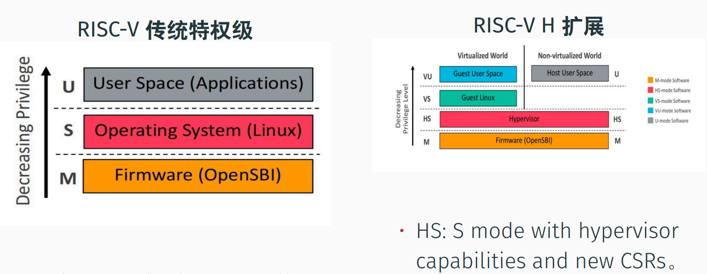
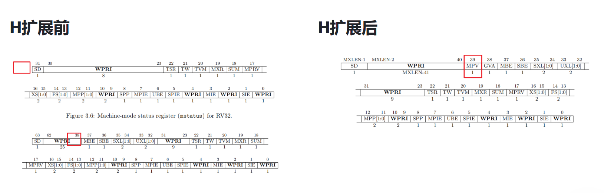
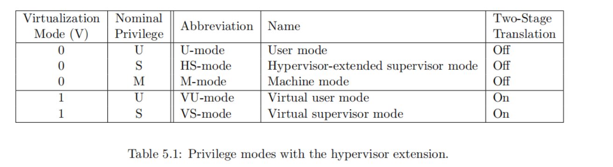

# Daily

## 2023.11.8 - 2023.11.12

- 补训练营第二阶段的坑。
- 学习了下 ArceOS 的框架和组件化OS理论
- 学习了虚拟化的一些简单基础知识
- 看了下RISC-V的H扩展资料

## 2023.11.13

在 ArceOS 上跑通了Linux，在看源码ing

### 简要记录

硬件虚拟化目前好像还不是很成熟。具体到RISC-V而言，貌似只有qemu完全支持了 RISC-V的H扩展，虽然目前已经有了开源的 H扩展的RTL实现，但没有商业化已流片的处理器支持H扩展（起码我目前查到的资料好像是没有)。x86 和 ARM 有了一些基本的解决方案，但好像还有不少问题没有解决？是块有潜力的半荒地。

RISC-V的引入了虚拟化的 H扩展后，通过添加新的CSR寄存器和指令，构建出了新的一套系统。或许也不能说是添加了新的CSR寄存器和指令？严谨说法应该是改造并添加了。

在引入了H扩展后的特权级模式下，HS 模式取代了原有的 S 模式，或者说 HS 模式其实也是S模式（说白的就是S模式在 H扩展下 功能加强了），然后往上加了一层VS模式从而实现虚拟化的设置。

下图是 <code>mstatus</code> 寄存器 不支持H扩展和 支持H扩展的位域图。可以看到RV32是不存在H扩展的可能的，在RISC-V 架构中，H扩展至少位宽得是64位。扩展后 <code>mstatus</code> 的 37 和 38 位从原来的写保留位，变成了 GVA 和 MPV。

设置 MPV 的值 其实就是设置 Virtualization Mode (V)。可以看出，即使处理器支持了 H扩展，使用权还是在程序员手里，不想用硬件虚拟化的话可以直接设置 $$V = 0$$ ，那就跟使用传统特权级模式一样了。

而 Hypercaft 是 hypervisor 的一个实现实例，也是我们这次的研究和扩展的对象。明天继续研究源码瞅瞅。。。

# Daily

## 2023.11.8 - 2023.11.12

- 补训练营第二阶段的坑。
- 学习了下 ArceOS 的框架和组件化OS理论
- 学习了虚拟化的一些简单基础知识
- 看了下RISC-V的H扩展资料

## 2023.11.13

在 ArceOS 上跑通了Linux，在看源码ing

### 简要记录

硬件虚拟化目前好像还不是很成熟。具体到RISC-V而言，貌似只有qemu完全支持了 RISC-V的H扩展，虽然目前已经有了开源的 H扩展的RTL实现，但没有商业化已流片的处理器支持H扩展（起码我目前查到的资料好像是没有)。x86 和 ARM 有了一些基本的解决方案，但好像还有不少问题没有解决？是块有潜力的半荒地。

RISC-V的引入了虚拟化的 H扩展后，通过添加新的CSR寄存器和指令，构建出了新的一套系统。或许也不能说是添加了新的CSR寄存器和指令？严谨说法应该是改造并添加了。

在引入了H扩展后的特权级模式下，HS 模式取代了原有的 S 模式，或者说 HS 模式其实也是S模式（说白的就是S模式在 H扩展下 功能加强了），然后往上加了一层VS模式从而实现虚拟化的设置。

下图是 <code>mstatus</code> 寄存器 不支持H扩展和 支持H扩展的位域图。可以看到RV32是不存在H扩展的可能的，在RISC-V 架构中，H扩展至少位宽得是64位。

设置 MPV 的值 其实就是设置 Virtualization Mode (V)。可以看出，即使处理器支持了 H扩展，使用权还是在程序员手里，不想用硬件虚拟化的话可以直接设置 $$V = 0$$ ，那就跟使用传统特权级模式一样了。

而 Hypercaft 是 hypervisor 的一个实现实例，也是我们这次的研究和扩展的对象。明天继续研究源码瞅瞅。。。
